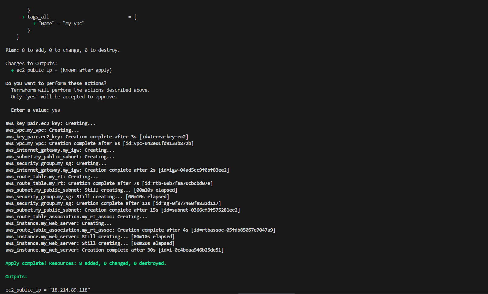
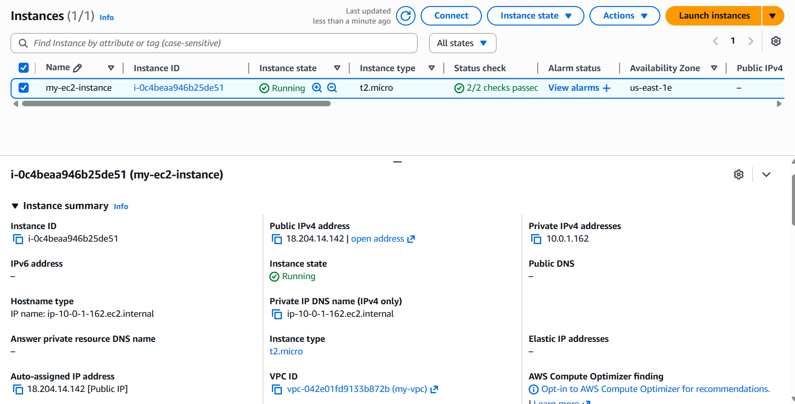
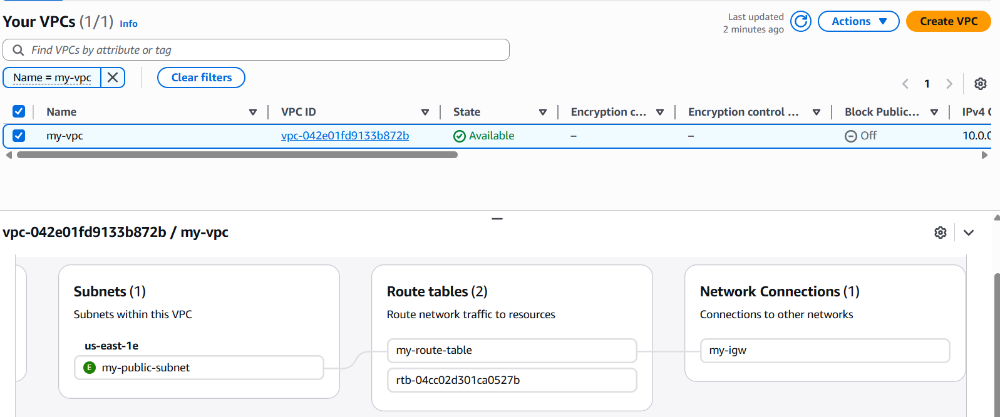

# 🚀 AWS EC2 Infrastructure Automation with Terraform

## 📝 What is this project?
I built this project to move away from **"Click-Ops"** (manually clicking around the AWS Console) and fully embrace **Infrastructure as Code (IaC)**. 

In this repository, I’ve shared my Terraform scripts that automatically set up a secure, custom VPC and launch a Linux EC2 instance. My main goal was to ensure that the entire networking stack—from subnets to routing—is repeatable and follows security best practices. I also focused heavily on security by ensuring sensitive files like state files and private keys are never exposed to version control.
## 🛠 Tech Stack

* **Infrastructure as Code:** Terraform (HCL)
* **Cloud Provider:** Amazon Web Services (AWS)
* **Networking:** VPC, Public Subnet, Internet Gateway (IGW), Route Tables
* **Compute:** EC2 (Amazon Linux 2)
* **Security:** Security Groups (SSH & HTTP access), SSH Key Pairs
* **Version Control:** Git & GitHub
## ✨ Features

* **Custom VPC Architecture:** Created a dedicated Virtual Private Cloud (VPC) to ensure the infrastructure is isolated and secure, rather than using the default AWS settings.
* **Automated Networking:** Configures the Public Subnet, Internet Gateway (IGW), and Route Tables automatically to provide the EC2 instance with internet connectivity.
* **Security Group Rules:** Implemented a restricted Security Group that only allows **SSH (Port 22)** for management and **HTTP (Port 80)** for web traffic.
* **Optimized Storage:** Provisions the EC2 instance with **gp3 EBS volumes**, providing better performance and cost-efficiency than the standard gp2.
* **Safe State Management:** Utilizes a professional `.gitignore` configuration to ensure that sensitive files like `terraform.tfstate` and private keys never leave the local environment.
## 🚀 Deployment Steps

Follow these steps to deploy this infrastructure in your own AWS account:

### 1. Prerequisites
* **AWS CLI** configured with your credentials.
* **Terraform** installed on your local machine.
* **SSH Key Pair:** Create a key pair directly in your project root folder using the command below. You can replace `"my-key"` with any name you prefer:
  ```bash
  ssh-keygen -f "my-key"
  ```
### 2. Initialize the Project
Download the necessary AWS providers and set up the working directory.
```bash
terraform init
```
### 3. Plan the Infrastructure
Preview the resources Terraform will create. This is a crucial step to verify your configuration before deployment.
```bash
terraform plan
```
### 4. Apply the Changes
Deploy the VPC, Networking, and EC2 instance to your AWS account.
```bash
terraform apply -auto-approve
```
### 5. Access the Instance
Once the process is complete, Terraform will display the Public IP. Use your private key to SSH into the instance:
```bash
ssh -i "your-key-name" ec2-user@<your-public-ip>
```
⚠️ **Note:** To avoid unexpected AWS charges, always run terraform destroy when you are finished with the project!
```bash
terraform destroy
```

## 📖 Usage & Examples

Once the deployment is successful, you can verify and interact with your new infrastructure in the following ways:

### 1. Verification via AWS Console
After running `terraform apply`, you will see the following resources created in your AWS account:
* A VPC named **"Custom-VPC"** (or your specified name).
* A running EC2 instance with the tag **"Terraform-Instance"**.
* A Security Group allowing traffic on ports **22** and **80**.

### 2. Accessing your EC2 Instance
Use the public IP address provided in the Terraform output to connect to your instance:
```bash
# Example command
ssh -i "my-key" ec2-user@3.84.123.45
```
### 3. Terraform Outputs
The project is configured to automatically display important information. You will see an output similar to this in your terminal:
```
Outputs:

ec2_public_ip = "3.84.123.45"
vpc_id        = "vpc-0a1b2c3d4e5f6g7h8"
```
### 4. Testing Connectivity
Once logged in, you can verify internet connectivity by pinging an external site or checking the instance metadata:
```bash
ping google.com
```
## 📸 Screenshots

Visual confirmation of the infrastructure deployment:

### 1. Terminal Execution
The successful output of the `terraform apply` command showing resources created.


### 2. AWS EC2 Instance
Confirmation of the instance running in the AWS Console with the specified configuration.


### 3. Network Infrastructure
View of the custom VPC and Subnets successfully provisioned by the script.

## ⚡Author
**Nishika Jaiswal**

Aspiring Cloud & DevOps Engineer